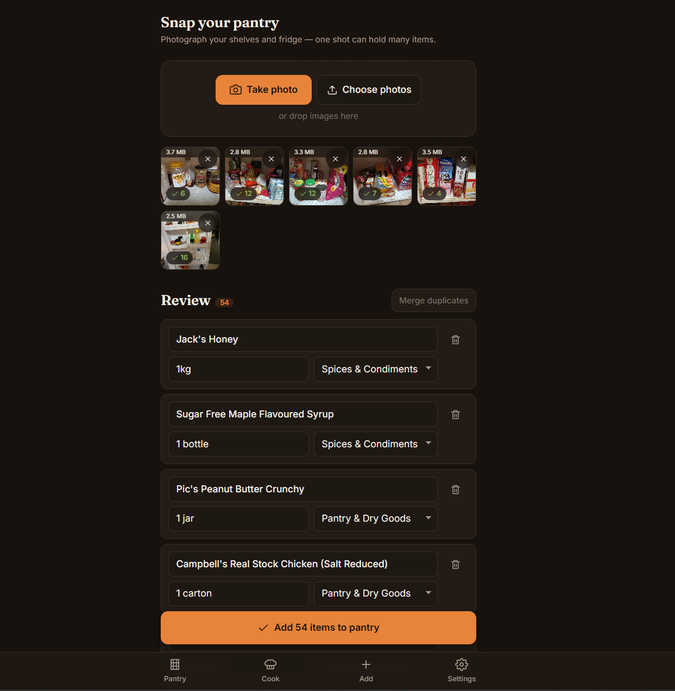
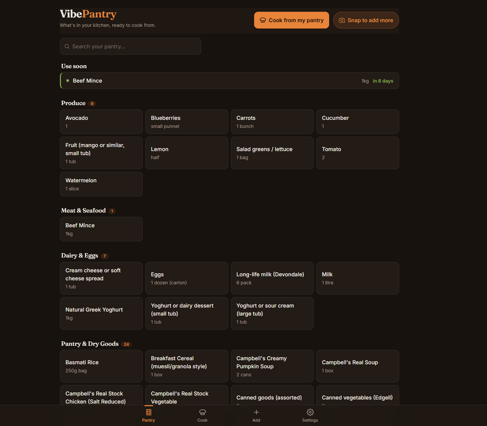
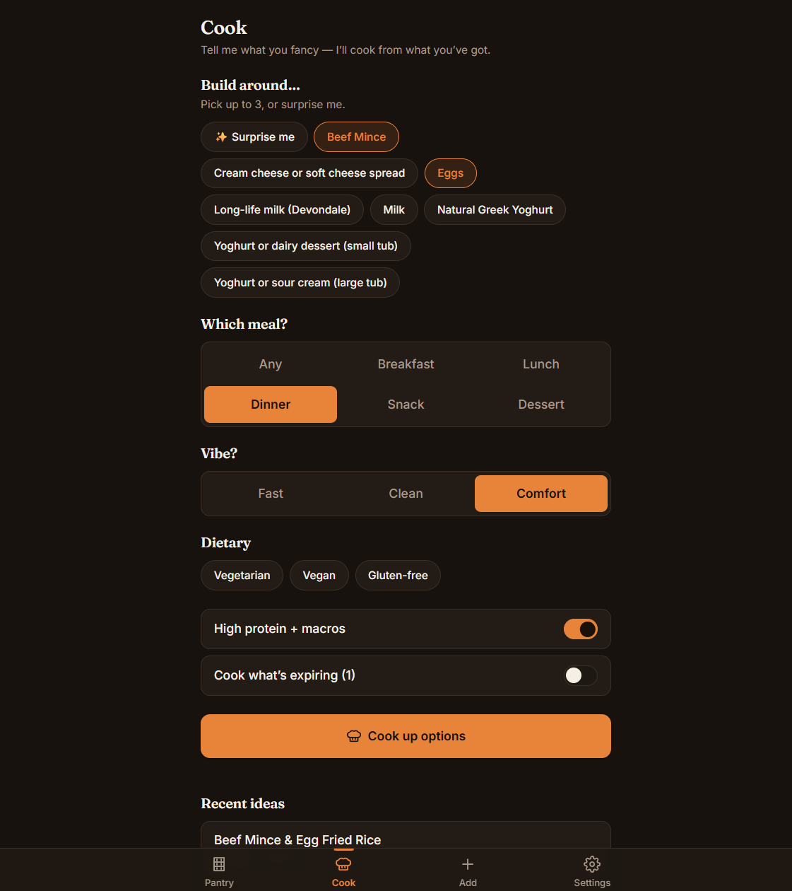
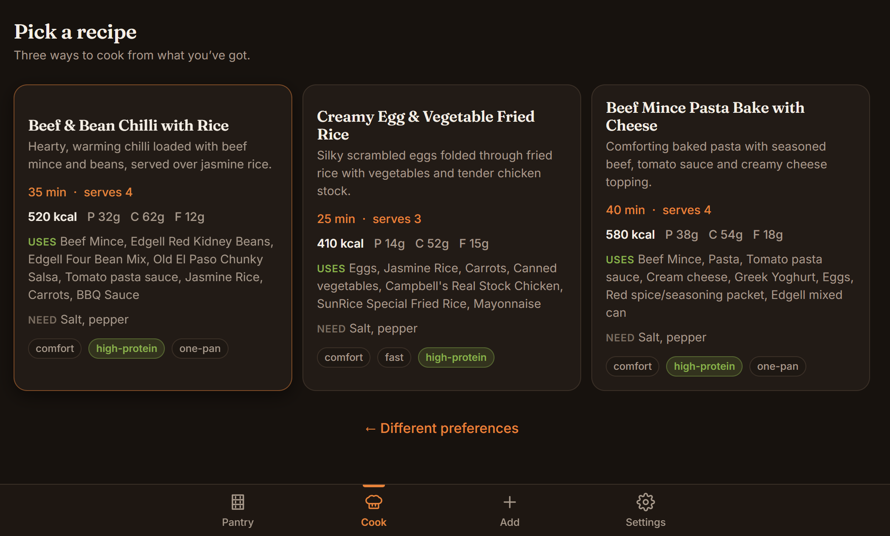
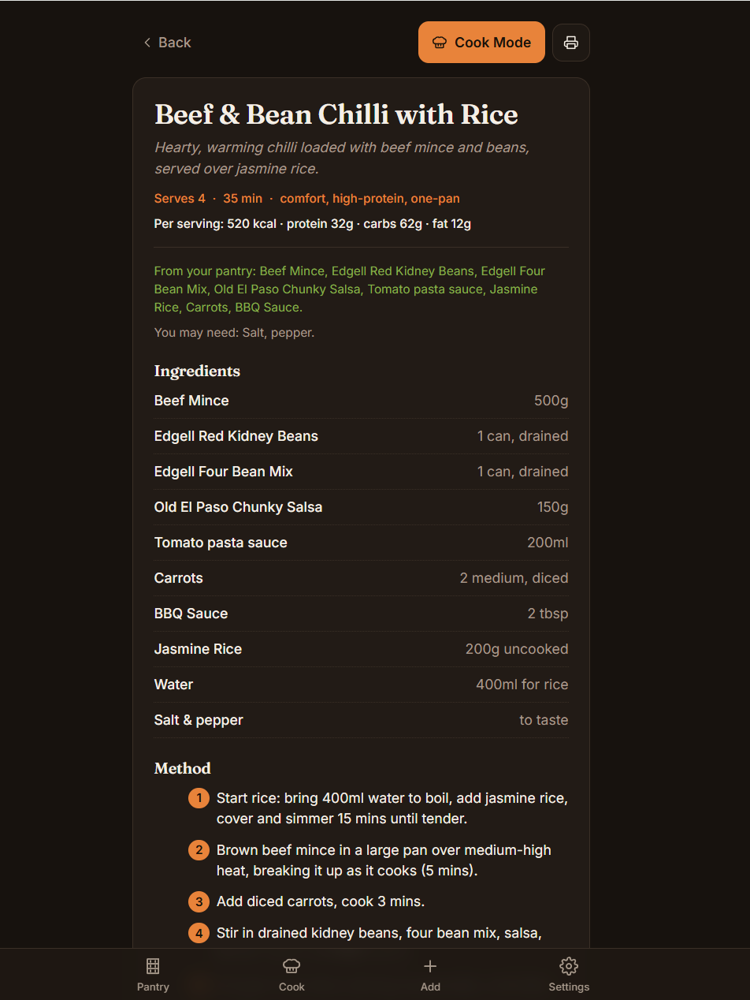
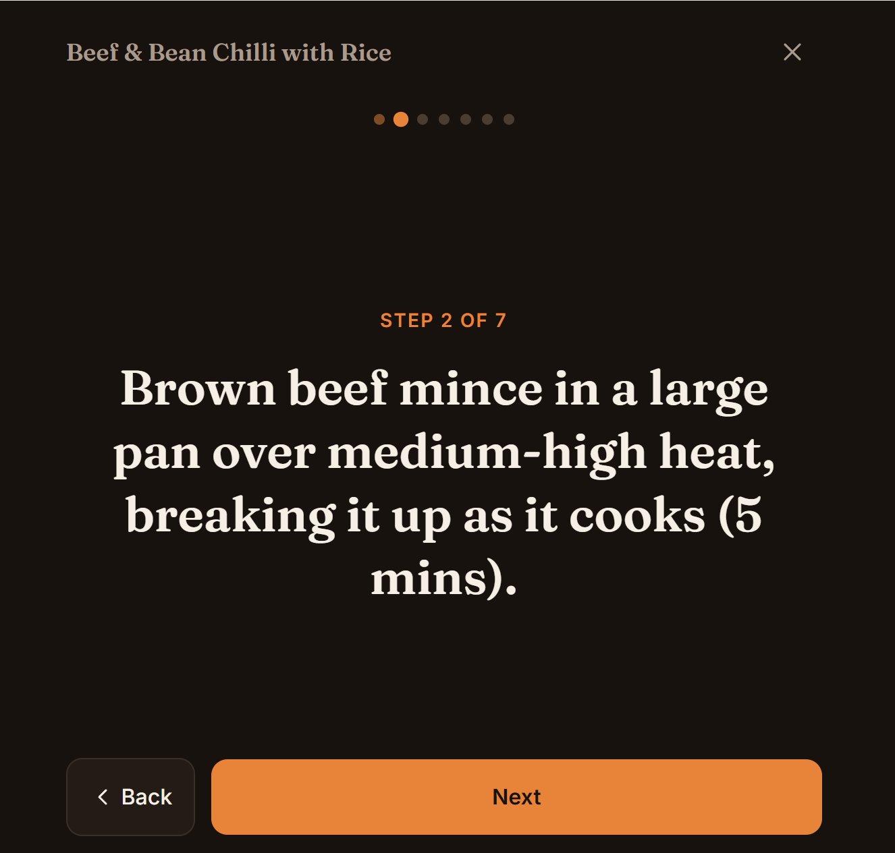

# VibePantry

> Snap your pantry, cook from what you have.

VibePantry turns photos of your kitchen into a working pantry, then cooks from
it. Photograph your shelves and fridge; AI vision extracts the items into one
editable grid you confirm in a single pass. From there you ask for a recipe,
answer one or two quick taps, and it proposes two or three dishes makeable from
what you actually have — finishing in a clean, one-page printable recipe card.

**It's a static, browser-only app. Bring your own Anthropic API key. Your data
never leaves your browser.**



*Photograph your shelves and fridge — one shot holds many items. Vision pulls everything into one grid you confirm in a single pass.*

## Why it's different

- 🗄️ **Local-first.** Your pantry, settings, and recipe history live in
  IndexedDB on your device. No accounts, no server, no cloud sync.
- 🔑 **Bring your own key.** Your Anthropic API key is stored only in your
  browser and is only ever sent to `api.anthropic.com` (or your own proxy — see
  below). It's never uploaded anywhere else and never committed to the repo.
- 🧱 **Pure static build.** No backend to stand up. Clone, build, and serve
  `dist/` on anything.
- 🍳 **Catalogue so it can cook for you** — the pantry is a means to the recipe,
  never the product itself.

## A look around



*Your pantry, built from those photos — searchable, grouped by category, with use-soon expiry nudges.*



*Tell it what you fancy — build around a few items, pick a meal and a vibe, set dietary preferences.*



*Two or three dishes you can actually make right now — with macros, and a clear "uses" vs "need" split.*



*Every recipe opens to full ingredients and method — with a print option and a step-by-step Cook Mode.*



*Cook Mode walks you through one step at a time, hands-free, in big readable type.*

## Quick start (development)

```bash
npm install
npm run dev      # landing: http://localhost:5173  ·  app: http://localhost:5173/app
```

Open the app at **`/app`**, go to **Settings**, paste your Anthropic API key, and
start snapping.

## Build & self-host

```bash
npm run build    # outputs a static site (incl. service worker) to dist/
```

`dist/` is a self-contained static PWA, served from a **domain root**. It puts a
landing page at `/` and the app itself at **`/app`** (the app uses hash routing,
so deep links like `/app#/cook` and refreshes work with a simple SPA fallback).
Host it three ways:

**1. Any static host** (Cloudflare Workers/Pages, Netlify, Vercel, an S3 bucket +
CDN): drop the contents of `dist/` in and add an SPA fallback to `index.html`.
The live site at vibepantry.com runs on **Cloudflare Workers static assets** —
the exact setup is in **[SETUP.md](./SETUP.md)**.

**2. GitHub Pages:** works on a **user/org site or a custom domain** (served at
the root). A `/<repo>/` project subpath won't work — the build uses absolute
asset paths. Push `dist/` to a `gh-pages` branch (or use an action).

**3. Docker (nginx):**

```bash
docker build -t vibepantry .
docker run -p 8080:80 vibepantry   # http://localhost:8080
```

It's an installable PWA — "Add to Home Screen" / "Install app" works, and the
app shell loads offline (AI calls obviously still need a connection).

## Getting an Anthropic API key

1. Sign up at [console.anthropic.com](https://console.anthropic.com/).
2. Add a little credit (you pay Anthropic directly for what you use — there's no
   middleman and no subscription).
3. Create an API key (`sk-ant-…`) and paste it into VibePantry → **Settings**.

VibePantry uses Claude **Sonnet** to read your photos (extraction quality is
make-or-break) and Claude **Haiku** by default to generate recipes — about a third of
the cost, and you can flip it back to Sonnet in **Settings**. Costs are small: a pantry
photo or a recipe request runs from a fraction of a cent to a few cents, billed by
Anthropic directly.

## Optional: keep your key server-side (proxy)

Prefer not to hold the key in the browser? Deploy the tiny Cloudflare Worker in
[`proxy/`](./proxy/README.md), then paste its URL into **Settings → Advanced —
custom API endpoint** and leave the key field blank. The app will route calls
through your Worker, which injects the key from a server-side secret. **The app
never depends on this** — direct mode is the default.

## How it works

Two AI calls, everything else local. Snap a photo → Sonnet extracts the items into a
grid you confirm → your pantry lives in IndexedDB → ask to cook → Haiku proposes
recipes from what you have → printable card. The key never leaves your browser. Full
walkthrough — the photo pipeline, the magic-link installer, the optional proxy, the
deploy model — is in **[docs/HOW-IT-WORKS.md](./docs/HOW-IT-WORKS.md)**.

## Tech

Vite · React · TypeScript · IndexedDB (`idb`) · React Router (hash) ·
`vite-plugin-pwa`. No server, no accounts, no tracking, no analytics.

## Roadmap (out of scope for v1)

These are deliberately **not** built:

- Accounts, multi-user, cloud sync
- Barcode scanning
- Shopping-list checkout
- Native mobile app-store builds

## License

[MIT](./LICENSE) — © 2026 Jack Archbold. Clone it, fork it, self-host it.

---

_VibePantry is an independent open-source project and is not affiliated with,
endorsed by, or sponsored by Anthropic. "Claude" and "Anthropic" are trademarks of
Anthropic, PBC._
